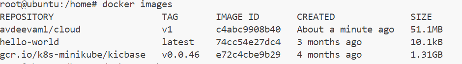
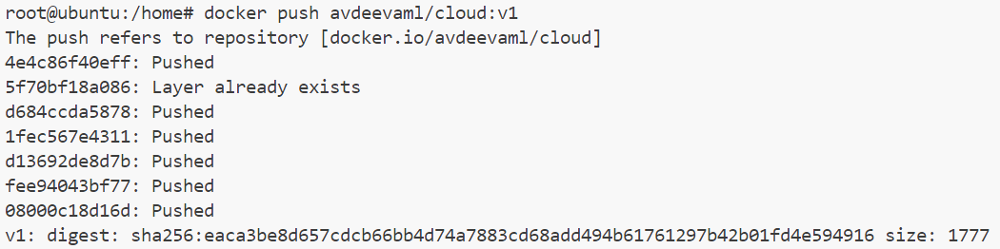
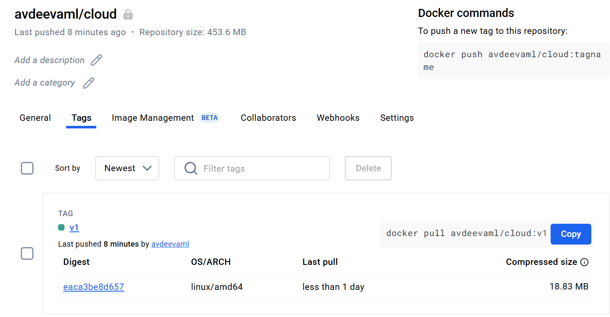

## 1. Web приложение на Python
команды, которые использовались для пуша образа в регистри

сборка image
```docker build . -t avdeevaml/cloud:v1  ```


```docker images```




```docker push avdeevaml/cloud:v1```



отображение образа в приватном регистри

