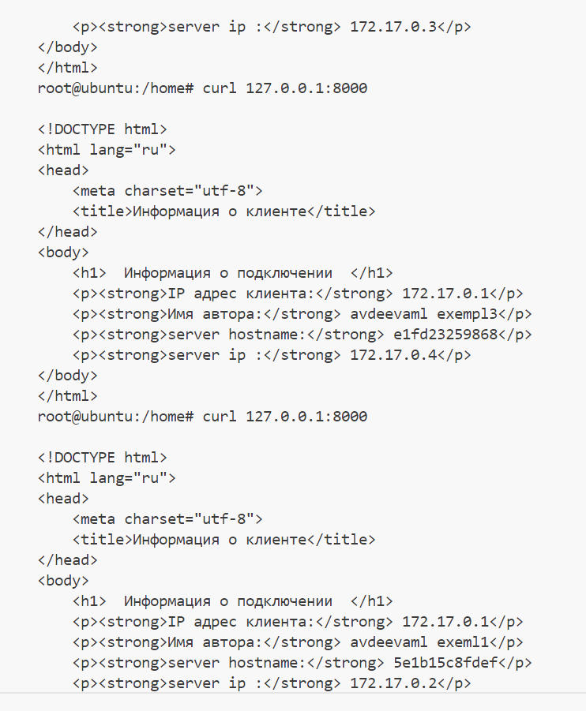

## выбор алгоритма

В контексте задания имеется одностраничное web-приложение, которое выдает ip адреса, hostname и переменную AUTHOR_NAME.
При такой конфигурации нет высоких нагрузок на сервер, на сервере также нет необходимости хранить состояние сессии. Поэтому в данном случае подойдет алгоритм Round Robin. Распределение нагрузки в данном случае будет предсказуемым и поочередным.

### проверка работы nginx

при обращении к серверу отвечают разные контейнеры

