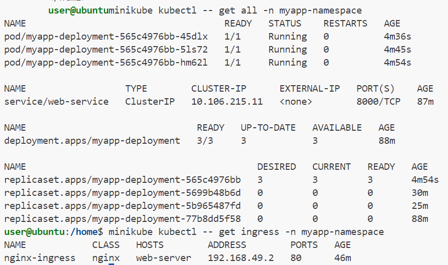
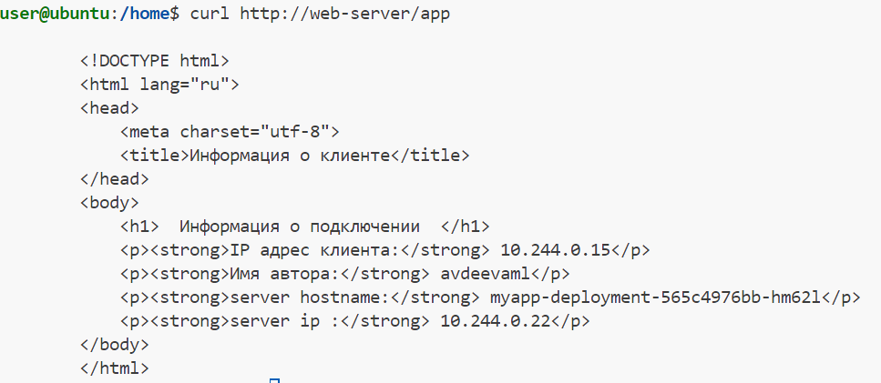

## Kubernetes manifest

Для работы приложения потребуется скачивать образ из приватного регистри, для чего нужно создать secret также прокинуть переменную окружения с именем автора, что можно сделать через config map.
liveness и Readness пробы можно сделать одинаковыми, поскольку в данном случае для обеих проб проверяется доступность по сети. Для доступа создадим ingress.

создадим namespace

```kubectl create namespase -f namespace.yaml```

создадим secret для логина в регистри

```kubectl create secret generic --from-file=.dockerconfigjson=/home/user/.docker/config.json --type=kubernetes.io/dockerconfigjson -n myapp-namespace mysecret```

создадим config map, которая будет использоваться для передачи переменной окружения

```kubectl apply -f config-map.yaml```

создадим deployment с сервисом

```kubectl create -f deployment.yaml```

для доступа создадим ingress

```kubectl apply -f ingress.yaml```



адрес и хост из ingress добавим в /etc/hosts

```echo "192.168.49.2 web-server" >> /etc/hosts```

проверка доступности

